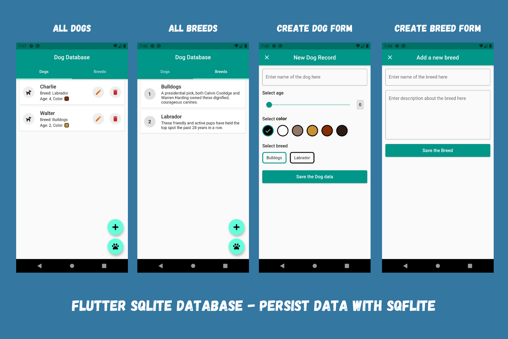

# Flutter Sqflite Example

Flutter SQLite Database - Persist Data with [sqflite](https://pub.dev/packages/sqflite). Learn how to use sqflite to store complex relational data locally in Flutter apps.

This project shows - 
- how to initialize sqflite local database.
- how to create multiple relational tables with primary and foreign key.
- how to insert data into the table.
- how to retrieve, modify and remove data from the table.
- how to display data in UI using FutureBuilder.

### Read the article [here on Medium]().

### Check the sample video [here on Instagram]().

## Preview

## Getting Started

For help getting started with Flutter, view our
[online documentation](https://flutter.dev/docs), which offers tutorials,
samples, guidance on mobile development, and a full API reference.

### If you like this repository, kindly give it a star ⭐
